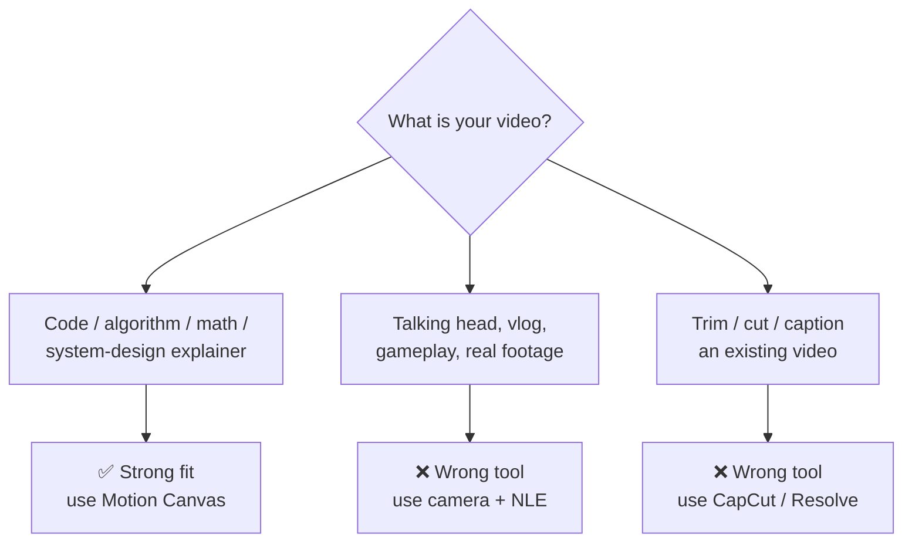
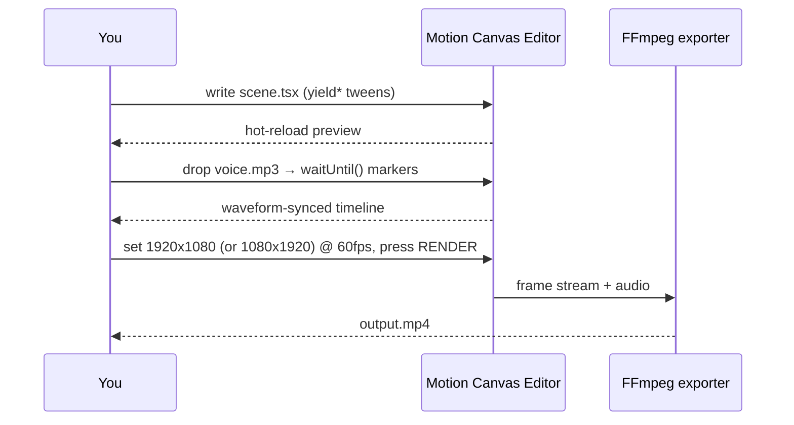

# Motion Canvas — Overview & YouTube Feasibility

> Audit date: 2026-08-20 · Repo: `surdarmaputra/motion-canvas` (fork of `motion-canvas/motion-canvas`)

---

## 1. What is this project

**Motion Canvas = code-driven motion graphics engine.** Not an AI tool. Not a video editor.

- TypeScript library → animations written as **generator functions** (`yield*` = time passing).
- Bundled **web editor** (Vite) → real-time preview, timeline, audio track, frame scrubbing.
- Purpose-built for **explainer / vector animations synced to a voice-over**.
- Author: **aarthificial** (YouTuber) → built it to make his own videos. MIT license.

Monorepo layout:

| Package | Role |
|---|---|
| `core` | animation runtime, tweening, signals, exporters |
| `2d` | the 2D renderer + all components |
| `ui` | the editor (preview, timeline, inspector) |
| `vite-plugin` | dev server + build glue |
| `ffmpeg` | FFmpeg exporter (client/server) → direct `.mp4` |
| `player` | `<motion-canvas-player>` web component for embedding |
| `create` / `template` / `examples` / `docs` / `e2e` / `internal` | scaffolding, samples, site, tests |

```mermaid
flowchart LR
  A["You write TSX scene<br/>src/scenes/*.tsx"] --> B["Vite plugin<br/>hot reload"]
  B --> C["Editor UI<br/>preview + timeline"]
  D["Assets<br/>mp3 / png / mp4 / svg"] --> C
  C --> E{Export}
  E -->|built-in| F["PNG/JPEG/WebP<br/>image sequence"]
  E -->|@motion-canvas/ffmpeg| G["MP4 + audio"]
  E -->|present| H["Live slides<br/>presentation mode"]
  F --> I["Premiere / Resolve / CapCut"]
```

---

## 2. Statistics

| Metric | Value | Source |
|---|---|---|
| GitHub stars | **~19,000** | upstream repo page |
| Forks / watchers / open issues | 808 / 84 / 151 | upstream repo page |
| Latest commit (this fork's `main`) | `7b91435` → **2026-07-02** · `refactor(docs): update domain (#1231)` | local git |
| Last *feature* commit | 2025-02-16 · `feat(ui): bring back audio offset editing (#1166)` | local git |
| Latest stable npm | **`3.17.2`** → published **2024-12-14** | npm registry |
| Latest pre-release | `3.18.0-alpha.0` → 2025-02-16 | npm registry |
| npm downloads `@motion-canvas/2d` | **10,894 / month** | npm API (2026-07-20 → 08-18) |
| npm downloads `@motion-canvas/core` | **9,166 / month** (2,695 / week) | npm API |
| First release | 2023-02-04 | npm registry |
| License / price | **MIT · free** (donations via GitHub Sponsors + Patreon) | `LICENSE`, `FUNDING.yml` |

⚠️ **Read the shape of this data:** 19k stars, but stable release frozen since Dec 2024 and ~10k downloads/month. → popular, stable, **low velocity**. Fine to build on; don't expect new features soon.

---

## 3. Capabilities

Format: **input → action → output → result**. Note: the "action" is **code you write**, never a prompt — there is zero AI/prompt layer in this repo.

1. **Program an animation**
   `scene.tsx` + components → `yield* node().scale(2, 1.5)` → frames on canvas
   → Result: precise, deterministic motion; every value is a number you control.

2. **Tween any property**
   start value + end value + duration + easing → `.to(v, t, easeInOutCubic)` → interpolated frames
   → Result: smooth transitions; save/restore, linear/cubic/color tweening built in.

3. **Compose with reactive signals**
   `createSignal()` + derived expressions → bind props to signals → auto-updating nodes
   → Result: change one value, whole graph follows — no manual keyframes.

4. **Draw with a component library**
   `Rect Circle Line Path Polygon Spline Bezier Curve Ray Knot Grid Icon Img SVG Video Txt Latex Code Layout Camera`
   → Result: shapes, flexbox-style `Layout`, LaTeX formulas, icon sets, camera moves.

5. **Animate code blocks**
   source string + diff → `Code` component transitions → typed/morphing syntax-highlighted code
   → Result: the classic "code morphs into new code" effect for dev content.

6. **Sync to a voice-over**
   `audio: voice.mp3` in `project.ts` + `waitUntil('event')` time events → editor timeline with waveform + draggable offset
   → Result: narration-locked animation; you nudge event markers in the UI, code stays clean.

7. **Embed images / video / audio as media**
   imported files → `` / `<Video ref>` `.play()` / project `audio` → composited into the scene
   → Result: existing footage can appear inside the animation as a layer.

8. **Scene flow & transitions**
   multiple scenes + `slideTransition()` etc. → sequenced project → one continuous timeline
   → Result: multi-segment videos without manual stitching.

9. **Export to video**
   render range + resolution + fps → `RENDER` in Video Settings → **MP4** (FFmpeg exporter, optional audio + faststart) or **PNG/JPEG/WebP sequence**
   → Result: finished file, or frames for your NLE.

10. **Presentation mode**
    `beginSlide('name')` markers → `PRESENT` instead of `RENDER` → live, SPACE-advanced slides
    → Result: animated conference-talk deck from the same source.

11. **Embed on the web**
    built project → `@motion-canvas/player` custom element → interactive animation in a page
    → Result: docs/blog embeds (the official docs site does exactly this).

---

## 4. Relevancy for YouTube video / Shorts

### 4.0 Verdict up front

**Fit = narrow but excellent.** → Motion Canvas is a *great* tool for **technical explainer animation**, and a *bad* tool for anything involving cameras, faces, or timeline editing of footage.



### 4.1 Content types — honest limits

| Content type | Can Motion Canvas do it? | Notes |
|---|---|---|
| Code walkthrough / algorithm viz | ✅ Excellent | `Code` component is best-in-class |
| Math / physics / data explainer | ✅ Excellent | `Latex`, `Spline`, signals |
| System-design / architecture diagrams in motion | ✅ Excellent | `Layout`, `Line`, `Camera` |
| Product/feature demo with UI mockups | ✅ Good | rebuild UI as shapes, or `Img` screenshots |
| Kinetic typography / lyric-style Shorts | ✅ Good | `Txt` + tweens |
| Logo sting / intro | ✅ Good | but overkill vs. AE |
| Character animation, rigged puppets | ⚠️ Weak | no bones/IK/skeleton system |
| Hand-drawn / frame-by-frame | ❌ No | it's programmatic only |
| 3D | ❌ No | 2D renderer only |
| Particle systems, physics sim | ⚠️ DIY | write your own loop; nothing built in |
| Talking head / real footage content | ❌ No | see 4.3 |
| Editing an existing video | ❌ No | see 4.5 |

**Real cost, be honest:** the limitation is **you**, not the library. Every second on screen is code you wrote. First 10-second animation ≈ hours. Expect **weeks** to get fluent with generators + signals.

### 4.2 Can it generate animation? → **YES, this is its entire purpose.**

Programmatic 2D vector animation, deterministic, exportable at any resolution/fps.



Shorts: just set **Resolution = 1080×1920** in Video Settings. ⚠️ Layouts do **not** auto-scale with resolution — design for vertical from the start, don't retrofit.

### 4.3 Can it generate real-person visuals? → **NO.**

- No AI, no generative model, no avatar, no lip-sync, no TTS anywhere in this repo.
- You can *display* a real person only by importing your own `.png`/`.mp4` via `Img`/`Video`.
- Faces/people must come from elsewhere (camera, stock, or an external AI tool).

### 4.4 Can it combine existing video + add ornaments/text? → **PARTIALLY — as compositing, not editing.**

- ✅ `<Video src={clip}>` + `.play()` → footage becomes a node in the scene; you can scale/rotate/mask/animate it and layer `Txt`, `Rect`, arrows on top.
- ⚠️ It renders through the **browser's** video decoding → frame-accurate export of heavy footage is the fragile part; long clips are slow and error-prone.
- ⚠️ No transcript, no captions tool, no audio mixing (project takes **one** audio track).
- 👉 Practical pattern: **render Motion Canvas graphics on transparent background → overlay in your NLE.** (Leave project background empty = transparent, export PNG sequence with alpha.)

### 4.5 Can it edit existing video? → **NO.**

| Editing task | Motion Canvas |
|---|---|
| Trim / cut / ripple delete | ❌ |
| Multi-track timeline | ❌ (one audio track, code-defined scenes) |
| Color grading, LUTs | ❌ |
| Audio mixing / ducking / SFX layers | ❌ |
| Auto-captions / subtitles | ❌ |
| Transitions between clips | ❌ (only between *scenes* you coded) |

→ It is a **generator**, not an **editor**. Pair it with CapCut / Premiere / Resolve.

### 4.6 Cost to produce

| Item | Price |
|---|---|
| Motion Canvas (all packages) | **$0** — MIT, no tiers, no cloud, no account |
| FFmpeg exporter | **$0**, auto-installed |
| Rendering | **$0** — local CPU/GPU, no render credits |
| Hosting/API | none — nothing phones home |
| Optional donation | GitHub Sponsors / Patreon (`aarthificial`) |

**Real budget is time + adjacent tools:**

| Line item | Typical cost |
|---|---|
| Your time (the dominant cost) | 3–10 h per finished minute, higher while learning |
| Voice-over: your own mic | $0 |
| Voice-over: TTS (ElevenLabs etc.) | ~$5–$22/mo tier — *external, not part of this project* |
| NLE for final assembly | $0 (DaVinci Resolve free / CapCut free) |
| Machine | any laptop that runs Node 16+ and Chrome |

→ **Marginal cost per video ≈ $0. Total cost ≈ your hours.**

### 4.7 How to start (30 minutes)

```bash
npm init @motion-canvas@latest     # pick TypeScript + Video (FFmpeg) exporter
cd <project> && npm install && npm start
# → open editor → edit src/scenes/example.tsx → set resolution → RENDER
```

Then: `project.ts` → add `audio: voice.mp3` → use `waitUntil('point')` in scenes → drag markers in the timeline.

### 4.8 Short verdict

> **Use it if** your YouTube content is technical explainers and you're comfortable in TypeScript → you get broadcast-quality, reusable, version-controlled animation for **$0/video**.
> **Skip it if** you need faces, footage editing, 3D, or fast turnaround without coding.
> **Best real setup:** Motion Canvas = *graphics generator* → NLE = *assembly line*.

---

## 5. Example showcase

**In this repo** → `packages/examples/src/scenes/` (each `.tsx` + `.meta`, rendered live in the docs site):

| Example | Shows |
|---|---|
| `quickstart.tsx` | the canonical first animation |
| `code.tsx` / `code-block.tsx` | animated syntax-highlighted code |
| `tweening-linear / -cubic / -color / -save-restore` | easing + interpolation |
| `layout.tsx` / `layout-group.tsx` | flexbox-style composition |
| `media-image.tsx` / `media-video.tsx` | importing assets |
| `transitions-first/-second.tsx` | scene-to-scene transitions |
| `tex.tsx` | LaTeX formulas |
| `presentation.tsx` | slide mode |
| `positioning`, `components`, `node-signal`, `random`, `logging` | core concepts |

Run them: `npm run docs:dev` → docs site with embedded players.

**Outside this repo:**

- [motion-canvas/examples](https://github.com/motion-canvas/examples) — full videos built with it
- [aarthificial on YouTube](https://www.youtube.com/watch?v=4kjEwvrDKlg) — "One Year of Motion Canvas" community showreel
- [Motion Canvas in More Depth](https://www.youtube.com/watch?v=5j_TENM6I0E) — how the engine works
- [Reviewing your Motion Canvas Animations](https://www.youtube.com/watch?v=lY6D9x9qCt4) — community code review
- [motioncanvas.io/docs](https://motioncanvas.io/docs/) — official docs with live embeds
- [Motion Canvas Studio (YouTube)](https://www.youtube.com/@MotionCanvasStudio) — tutorials

---

### Sources

- [github.com/motion-canvas/motion-canvas](https://github.com/motion-canvas/motion-canvas) · [motioncanvas.io](https://motioncanvas.io/) · [npm ~aarthificial](https://www.npmjs.com/~aarthificial) · npm registry + downloads API · local `git log`, `packages/docs/`, `packages/2d/`, `packages/examples/`
